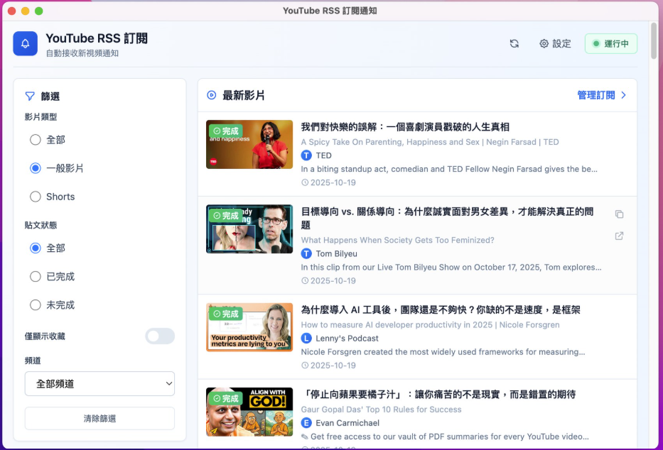

# YouTube RSS 訂閱通知 - 開發指南

## 專案架構

- **前端**: Electron + React + Vite
- **後端**: FastAPI (Python)
- **API Port**: 8000
- **前端 Dev Port**: 5173

## 參考介面



---

## 快速啟動

### 1️⃣ 後端啟動

```bash
cd "c:\Users\Misio\Desktop\Youtube Reader\backend"

# 首次執行：安裝依賴
pip install -r requirements.txt

# 啟動後端 API
python main.py
```

**後端會運行在**: `http://127.0.0.1:8000`

### 2️⃣ 前端啟動

```bash
cd "c:\Users\Misio\Desktop\Youtube Reader\frontend"

# 首次執行：安裝依賴
npm install

# 啟動開發模式 (Vite + Electron)
npm run dev
```

這會同時啟動:
- Vite 開發伺服器 (port 5173)
- Electron 桌面應用程式視窗

---

## 其他指令

### 前端

```bash
# 僅啟動 Vite (不開 Electron)
npm run dev:vite

# 僅啟動 Electron
npm run dev:electron

# 建置生產版本
npm run build

# 預覽建置結果
npm run preview

# Lint 檢查
npm run lint
```

### 後端

```bash
# 查看可用的 AI 模型
python list_models.py

# 測試影片處理
python test_video.py

# Debug 相關
python debug_ai.py
python debug_subs.py
python debug_audio_process.py
```

---

## 環境需求

### Python
- Python 3.8+
- FastAPI
- uvicorn
- Google API 相關套件 (詳見 `requirements.txt`)

### Node.js
- Node.js 16+
- npm 或 yarn

### 其他
- FFmpeg (用於音訊處理)
  - 執行 `python install_ffmpeg.py` 自動安裝

---

## API 端點

| 端點 | 方法 | 說明 |
|------|------|------|
| `/` | GET | 健康檢查 |
| `/auth/login` | GET | Google 登入 |
| `/auth/status` | GET | 檢查登入狀態 |
| `/subscriptions` | GET | 取得訂閱頻道 (已釘選或前 50) |
| `/subscriptions/all` | GET | 取得所有訂閱 |
| `/subscriptions/pin/{channel_id}` | POST | 釘選頻道 |
| `/subscriptions/unpin/{channel_id}` | POST | 取消釘選 |
| `/videos/{channel_id}` | GET | 取得頻道影片 |
| `/process/{video_id}` | POST | 處理影片 (生成摘要) |
| `/metadata/{video_id}` | GET/POST | 取得/更新影片 metadata |

---

## 開發流程

1. **啟動後端** → 確認 `http://127.0.0.1:8000` 可訪問
2. **啟動前端** → Electron 視窗自動開啟
3. **登入 Google** → 授權 YouTube API 存取
4. **開始開發** 🚀

---

## 疑難排解

### 後端無法啟動
- 檢查 Python 版本: `python --version`
- 重新安裝依賴: `pip install -r requirements.txt --force-reinstall`
- 檢查 `.env` 檔案是否存在 (Google API 憑證)

### 前端無法啟動
- 刪除 `node_modules` 重新安裝: `rm -rf node_modules && npm install`
- 檢查 port 5173 是否被占用
- 確認後端已啟動

### Electron 視窗黑屏
- 檢查 Vite 是否正常運行在 port 5173
- 查看開發者工具 Console (F12)
